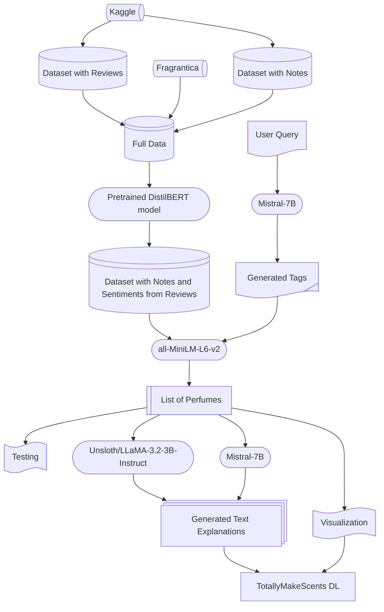

# TotallyMakeScents
##### Juntong Su, Ngan (Elly) Do, and Fernando Liu Lopez

## Introduction
We developed a perfume recommendation system that understands user queries. It accepts various types of text input, which could be the users' favorite notes and accords, the desired occasions to wear the perfumes, or even a piece of poem about the mood. The recommender returns a list of perfumes, with vibrant graphs displaying the basic properties of the perfumes, and generated text explanations for the recommendations. Our recommender is the first that deciphers the needs of the users from plain text, and justifies its solutions with data visualizations and brief descriptions. This project saves time and energy for the customers by lifting the burden of searching for a perfume on the internet, which could be a swamp of pointless comments and debates. New users are warmly welcomed to perfumes by the user-friendly app interface and easy to understand demonstrations, even without access to samples. Perfume creators and companies can use our model for insights into perfume designs and promotions. Just enter a sentence, we make scents and it makes sense. 

### Workflow


### Repository Structure (Selected)
```text
totallymakescents/
├── app/
│   ├── images/
│   │   └── tms_logo.png
│   ├── pages/
│   │   ├── about_help.py
│   │   ├── about_readme.py
│   │   ├── about_us.py
│   │   ├── explore_exhibition.py
│   │   ├── explore_potd.py
│   │   ├── explore_tableau.py
│   │   ├── tms_home_colab_deployment.ipynb
│   │   ├── tms_home.py
│   │   ├── tms_lite.py
│   │   └── tms_pro.py
│   ├── environment.yml
│   └── totallymakescents.py
├── archive/
├── data/
│   ├── tms_lite/
│   ├── tms_pro/
│   └── data_download.ipynb
├── data_analysis/
│   ├── accords.twbx
│   └── perc_by_features.twbx
├── generated_data/
│   ├── findascent_note_descriptions.csv
│   ├── notes.csv
│   ├── perfume_descriptions_creative.csv
│   ├── perfume_descriptions_poetic.csv
│   ├── perfume_descriptions.csv
│   ├── generating_training_data.ipynb
│   ├── cpt_perfume.jsonl
│   ├── training_data.jsonl
│   └── training_data_chatml.jsonl
├── models/
│   ├── llama-model/
│   ├── mistral_7B-v0.3-cpt.ipynb
│   ├── mistral_7B-v0.3-fine_tune.ipynb
│   ├── generating_training_data.ipynb
│   ├── recommend_with_tags.ipynb
│   ├── recommend_without_tags.ipynb
│   ├── streamlit_llm_with_tags_py.ipynb
│   └── streamlit_llm_without_tags_py.ipynb
├── recommender/
│   ├── version_delta/
│   |   └── recommender_func.py
│   └── version_epsilon/
│       ├── helper_funcs.py
│       └── recommender_func.py
├── web_scraping/
│   ├── data/
│   ├── frag_notes_scrape.ipynb
│   ├── frag_perf_scrape.ipynb
│   └── fragrantica_overview.csv
└── README.md    
```    

## Data
Our primary datasets were the publicly available [Fragrantica dataset](https://www.kaggle.com/datasets/olgagmiufana1/fragrantica-com-fragrance-dataset) from Kaggle, which contains basic information about perfumes, including their notes and accords, and another [Fragrantica dataset](https://www.kaggle.com/datasets/joehusseinmama/fragrantica-data/data) that shares many perfumes with the first one but also includes a “reviews” column. To enhance our data, we developed custom [web-scraping functions](https://github.com/juntongsu/totallymakescents/blob/main/web_scraping/frag_perf_scrape.ipynb) capable of doubling both the size of the database and the number of available features (see Table 1 and Figure 1). 
<figure>
  
  <figcaption>Table 1</figcaption>
</figure>

<figure>
  
  <figcaption>Figure 1</figcaption>
</figure>

Due to time constraints, the full compilation of the improved dataset was consigned as a future objective. However, we repurposed the scraping tools to operate in the background at runtime once recommendations are generated, ensuring users to see detailed information about their recommended perfumes (see Figure 2).
<figure>
  
  <figcaption>Figure 2</figcaption>
</figure>

For model training, we combined [scraped data](https://github.com/juntongsu/totallymakescents/blob/main/web_scraping/frag_notes_scrape.ipynb) from Fragrantica and FindaScent, synthetically generated perfume descriptions [[1]](https://github.com/juntongsu/totallymakescents/blob/main/generated_data/perfume_descriptions.csv) [[2]](https://github.com/juntongsu/totallymakescents/blob/main/generated_data/perfume_descriptions_creative.csv), and hand-crafted data. The [descriptive perfume data](https://github.com/juntongsu/totallymakescents/blob/main/generated_data/findascent_note_descriptions.csv) and perfume descriptions were used to allow models to understand perfume notes and the sensory language associated with each. Additionally, we developed [scripts](https://github.com/juntongsu/totallymakescents/blob/main/generated_data/generating_training_data.ipynb) to generate a [question-answer training set](https://github.com/juntongsu/totallymakescents/blob/main/generated_data/training_data_chatml.jsonl) designed to generate relevant perfume notes from abstract queries and situational prompts.


## Model
Our recommender combines two models: `mistral-7B-v0.3` and `all-MiniLM-L6-v2`. We applied continued pre-training to Mistral using 2055 entries of descriptive perfume data, using it to generate natural-language explanations connecting recommendations to the user’s query. In addition, we experimented with a fine-tuned `Unsloth/LLaMA-3.2-3B-Instruct` model to generate similarly styled explanations with smaller memory and compute requirements. We further fine-tuned Mistral with 2000 question-answer pairs mapping abstract perfume queries to relevant perfume notes. The user’s query and the generated tags were then passed to the semantic search model `all-MiniLM-L6-v2`. The tags expanded the vocabulary through which the model could produce associations, allowing for more relevant recommendations. Furthermore, the tags accounted for users whose queries were brief, abstract, or lacking in specialized perfume terminology.

After obtaining the embeddings for the user's query and the generated tags, we proceed to compare them to the perfume embeddings generated from our primary datasets. To build the perfume embeddings, we combined notes, accords, and user reviews, where reviews were first classified by sentiment using a [pretrained `DistilBERT` model](https://huggingface.co/distilbert/distilbert-base-uncased-finetuned-sst-2-english), with positive reviews receiving higher weights. Based on embedding similarity, we return the top-k most relevant perfumes to user query.


## Testing
We broke our test down into two parts: one on standard user queries, and the other on non-standard user queries. The motivation behind this split is the different levels of user experiences.

Experienced users tend to know exactly what accords and notes that they are looking for. They might ask directly “I want something {*accord*} with {*note1*} and {*note2*} {*occasion*}”. These are standard queries with direct references to perfume-related terms, so we skip the tag generation step and feed them into the BERT-model for scoring.

On the other hand, new users might ask more open-ended prompts such as “What perfumes capture the essence of a natural new home?”. These are non-standard queries, lacking terms related directly to perfumes. Thus, we use our tag-generation LLM to construct note-related and accord-related tags before performing the recommendations. 

For both types of queries, the models return top-3 highest scored perfumes. Since there is no existing ground truth, we conducted a human labeling preference test. We act as human labelers to rate the relevance of notes and accords of each recommended perfume to user queries: 
- Yes (`1`) means the perfume is well-related to the query.
- No (`0`) means the perfume is poorly related.

For each perfume, we computed the proportion of “yes” labels and then averaged over all perfumes and queries. The results tell us that our models perfume consistently well on both types of queries:
- Without tags (standard queries): Average fraction of relevant items in top-k = 0.89 (across 34 queries and 102 ratings)
- With tags (non-standard queries): Average fraction of relevant items in top-k = 0.88 (across 34 queries and 102 ratings)


## Future
We would like to answer the question: What does it smell like in a movie or a book? We can easily access the summaries of the works through public datasets, and create the embeddings with the exact same models. The users can search for and select a work in the library, and the recommender goes through the same process and recommends perfumes. 

Please stay tuned as we **make scents**!

## Acknowledgements
We would like to thank Yevgeniya (Jonah) Tarasova for creating the wonderful collaborative-filtering model in the Data Science Bootcamp hosted by the Erdös Institute in Spring 2025. Thank you our mentors Steven Gubkin and Aditya Chander, for all the brilliant insights and inspirations. 

A warm hug to Katherine Martin, whose path has overlapped with ours, and thank you for your interests and expertise in scents and their effects on human emotions. We appreciate the help and advice from Lindsay Warrenburg, our mentor in the Deep Learning Bootcamp Summer 2025.